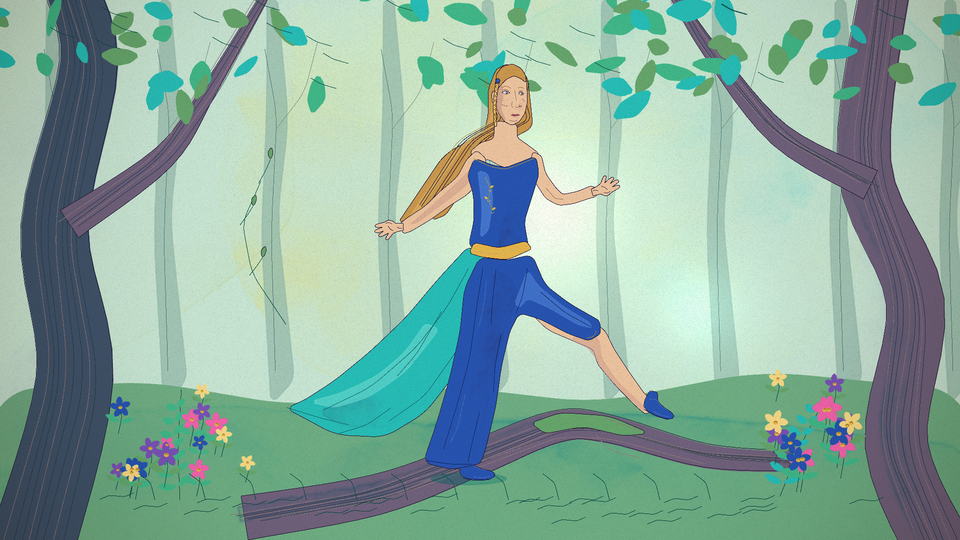
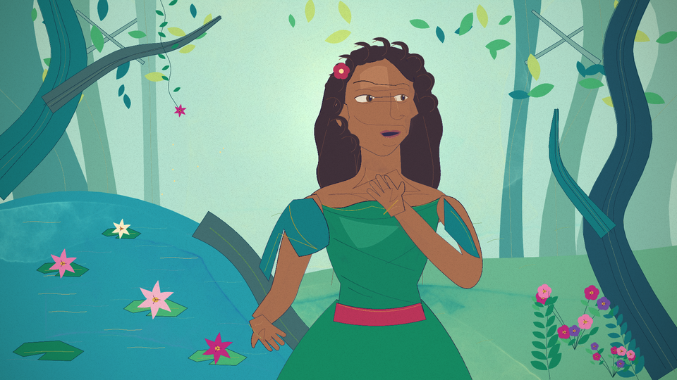
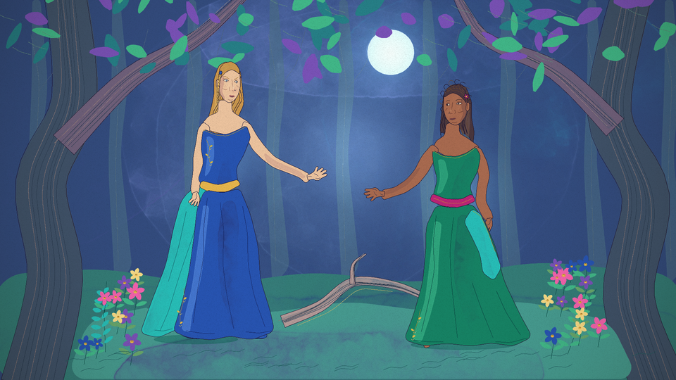
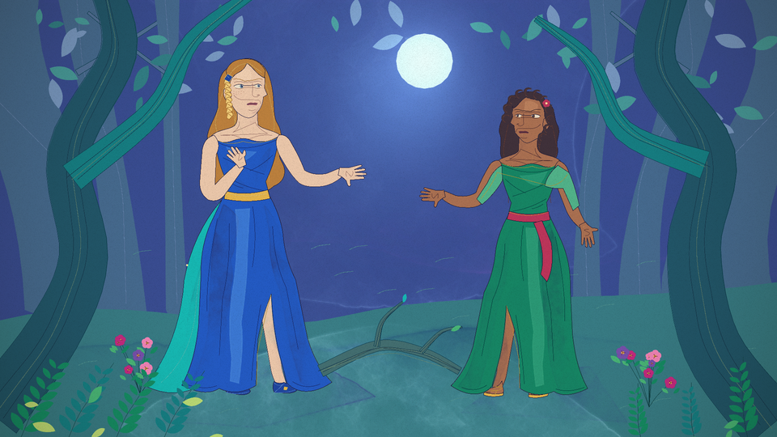
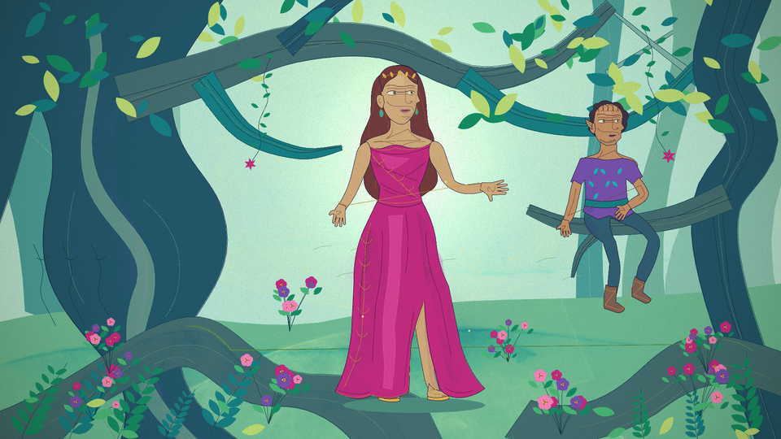

# Five-scene painting comparison

10 reviewed paintings across four requested model lanes. Full-resolution originals remain private; these 960×540 previews are cleared for public reuse. All paintings are stills.

Phone galleries with one painting per row: [GPT-6.1 Sol](gallery-sol.md) · [GPT-6 Astra](gallery-astra.md).

| Scene | Sol | Astra | Opus | Fable |
| --- | --- | --- | --- | --- |
| P01 |  |  | No completed painting | No completed painting |
| P02 |  |  | No completed painting | No completed painting |
| P03 |  |  | No completed painting | No completed painting |
| P04 |  |  | No completed painting | No completed painting |
| P05 |  |  | No completed painting | No completed painting |

[Brief](brief.md) · [Cast](cast.json) · [Settings](settings.json) · [Scores and evidence](results.json) · [Review](../../reviews/panel-comparison.md)

Source in source/<lane>/<pass> is preserved exactly as returned. The selected pass is recorded per image; no drawing source was merged between models. A corrected package is selected when it passes the source, receipt, render and coverage checks; otherwise the valid draft is retained.

To reproduce, copy art/engine into a disposable project, provide its declared dependency versions, copy the chosen package’s three src files into the same project and replace src/manifest.js with this comparison’s manifest.js. Set CHROME_PATH to your installed Chrome and run node render.mjs --loop=P01 --stills=0 --captions=0 --page=panel-studio.html --out=<fresh-output-directory>, repeating P02–P05. Use an external 90-second job limit. Browser/GPU rounding may differ; exact original and preview hashes are in results.json.
