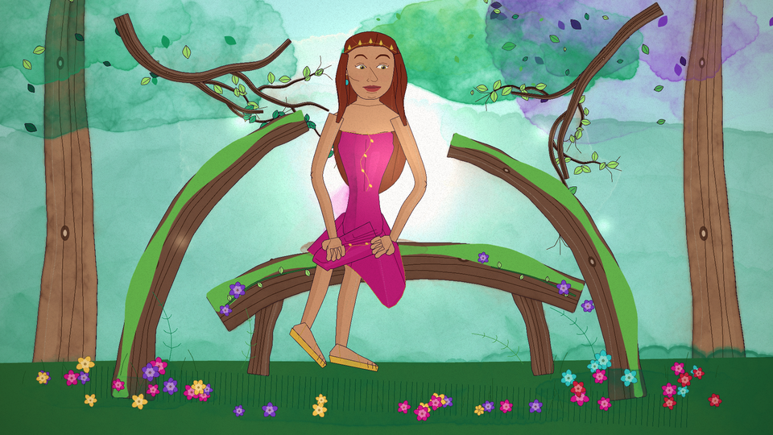
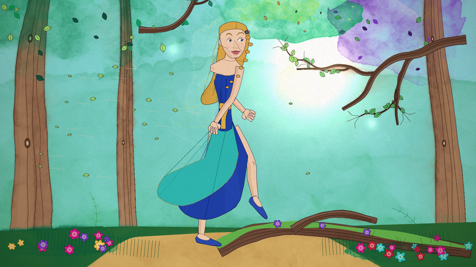
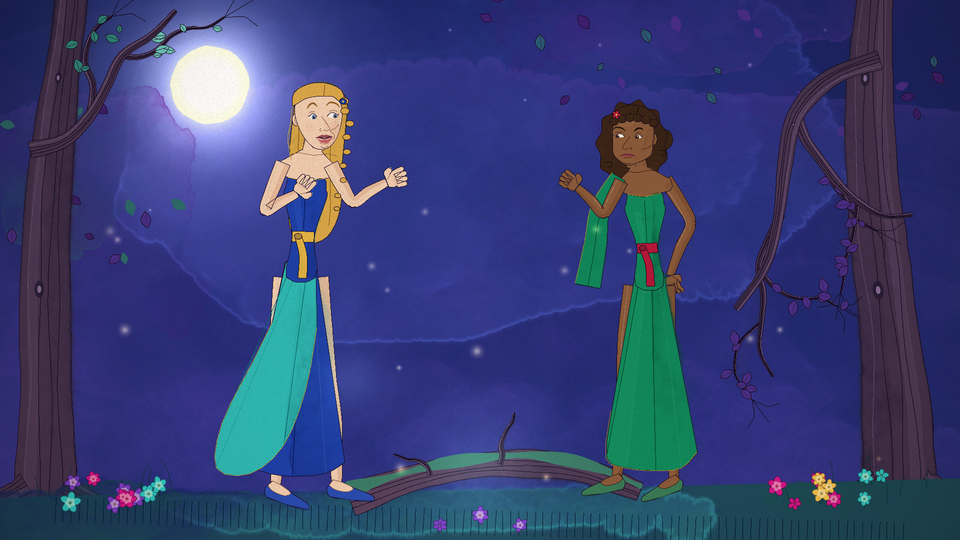
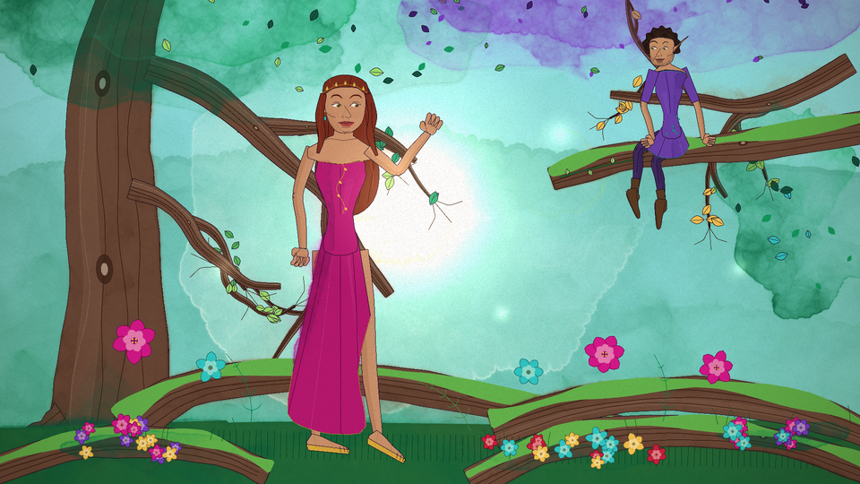

# Claude Fable 5.1 — five painted stills

One painting per row for phone reading. The selected complete package and actual recovery calls are recorded in the evidence. Previews are 960×540; exact 1920×1080 masters are offered separately as release downloads. [Desktop comparison](README.md) · [Scores and evidence](results.json)

## P01 — Root throne

[Download 1920×1080 PNG](https://github.com/dfakkeldy/midsummer/releases/download/paintings-2026-10-05-complete/fable-P01.png)

## P02 — Forest stride

[Download 1920×1080 PNG](https://github.com/dfakkeldy/midsummer/releases/download/paintings-2026-10-05-complete/fable-P02.png)

## P03 — Lily-pool portrait

[Download 1920×1080 PNG](https://github.com/dfakkeldy/midsummer/releases/download/paintings-2026-10-05-complete/fable-P03.png)

## P04 — Moonlit disagreement

[Download 1920×1080 PNG](https://github.com/dfakkeldy/midsummer/releases/download/paintings-2026-10-05-complete/fable-P04.png)

## P05 — Canopy court

[Download 1920×1080 PNG](https://github.com/dfakkeldy/midsummer/releases/download/paintings-2026-10-05-complete/fable-P05.png)
